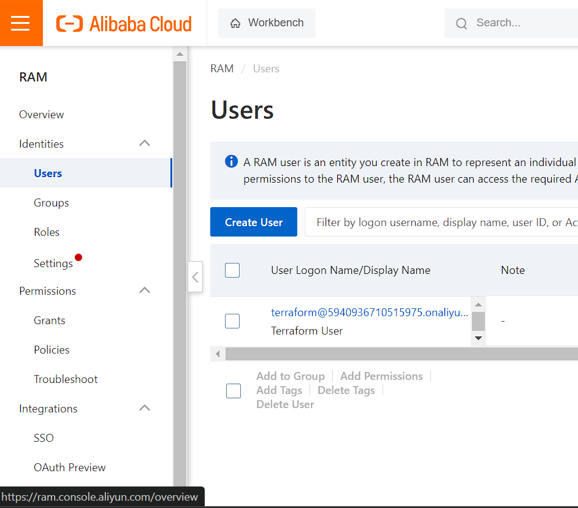
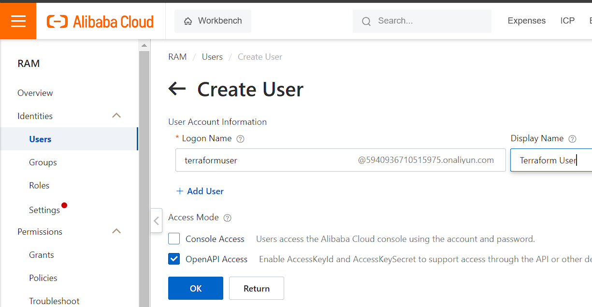
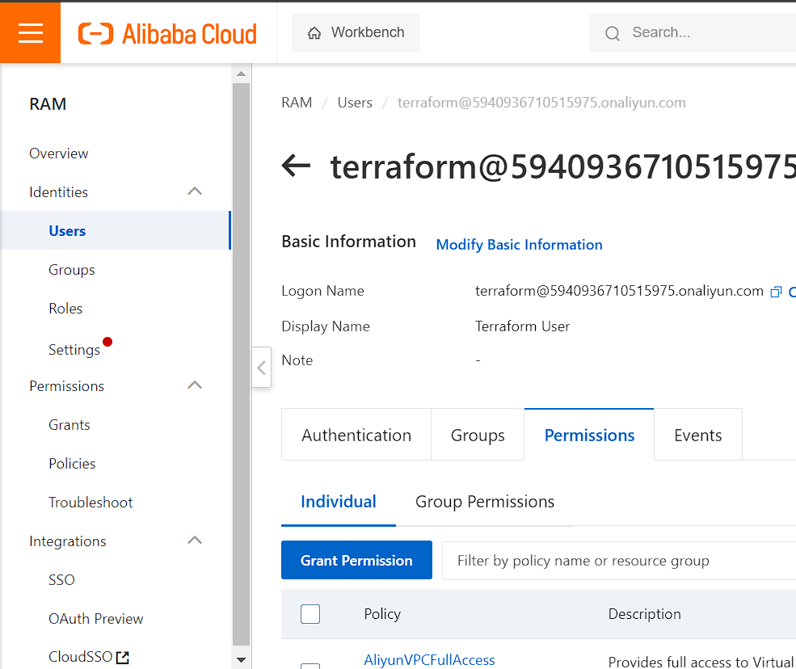
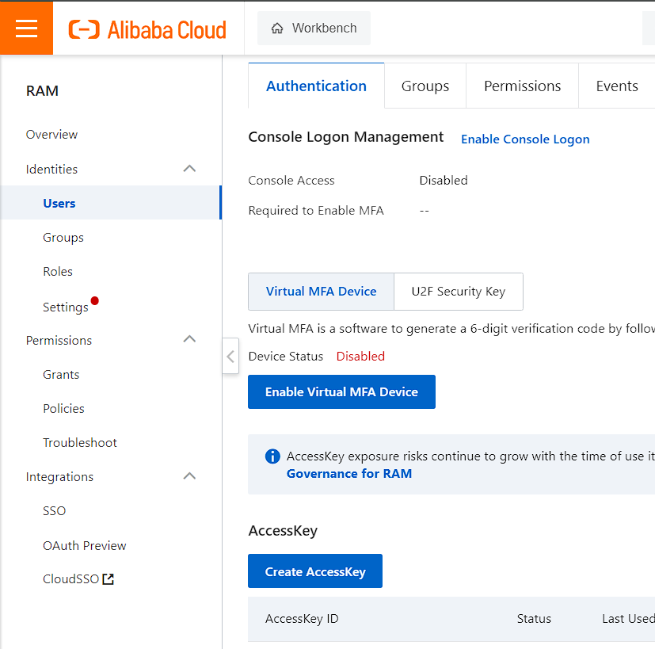

# INFRA SETUP ALIBABA CLOUD(ALIYUN)

**Welcome** to the aliyun infra setup.

## Setting-Up
> You can follow [this link](https://www.alibabacloud.com/help/en/cloud-shell/use-terraform-to-manage-alibaba-cloud-resources)
to get a basic idea of how to setup this provider or if you encounter issues with this guide.

|Tested OS|
|---------|
|Ubuntu-22-04-lts|

- Ensure the `ansible_user:`, `ansible_ssh_public_key_file`, and `ansible_ssh_private_key_file:` have been set in your `<group-name>.yml` file.

- Create an account on [Alibaba Cloud](https://www.alibabacloud.com/).
- Navigate to the [RAM users View](https://ram.console.aliyun.com/users) and click on `Create User`.

- Give it a logon name and display name.
- For `Access Mode` Check `OpenAPI Access` and click on ok. An access key pair should be presented. Copy it.

- Click on the created user and under the `Permissions` tab, click Grant Permission and grant **at least**
the following permissions: `AliyunVPCFullAccess`,`AliyunECSFullAccess`.

- If you weren't able to grab your accesskey pair, click on the `Authentication` tab and
under `AccessKey` click Create AccessKey.

- Copy the generated credentials.

- Export the  values as environment variables with the following keys.
eg.
```bash
$ export ALICLOUD_ACCESS_KEY="xxxxxxxx"
$ export ALICLOUD_SECRET_KEY="yyyyyy"
$ export ALICLOUD_REGION="cn-beijing" #put whatever valid region you want
```
- If you don't want to export the variable all the time, you can create one of the following env files(priority is as listed) and put the environment variables there:
    - `<group-name>.env` file in the `group_vars` folder eg. dev.env(Highest priority).
    - `.env` file in the `group_vars` folder.
    - `.env` file at the root of the project (lowest priority).

The content will look like this:
```
ALICLOUD_ACCESS_KEY=xxxxxxxx
ALICLOUD_SECRET_KEY=yyyyyyy
ALICLOUD_REGION=zzzzzzzzz
```
> Tip: .env files don't need double quotes.

- Create variables specific to this provider in your group vars file.
eg. in staging.yml
``` yaml
prefix: micro
#...
azure:
    quantity: 3
    size: nano
    region: "nyc3"
    image: 
        sku: ubuntu-22-04-x64
    # custom_sizes: ['s-1vcpu-512mb-10gb'] # region sensitive 
    local_volume_sizes: [3]
    ceph_volume_sizes: [3]
    tag:
        prov: "do"
```
> Tip: Before configuring your sizing, you should consider checking the subscription resource quota limits
for your chosen region. eg. `az vm list-usage --location "West US 2" --output table`
- You can return back to the main [README](../../README.md) to complete the setup.
___

## More Info
- For a list of valid instance types see [here](https://g.alicdn.com/aliyun/ecs-price-info-intl/2.0.275/price/download/instancePrice.json)
- For how to see valid VM images, see [here](https://learn.microsoft.com/en-us/azure/virtual-machines/linux/cli-ps-findimage)

| References|
|-----------|
| https://registry.terraform.io/providers/aliyun/alicloud/latest/docs#authentication |
| Activation of FibreNet_Unlimited_6months_50Mbps_2800 Voice for FibreNet Account  was successful and expires on 20/11/2024 16:36:13. Enjoy internet speed of up to 50Mbps and 2,800 mins for your local calls. Thank you! |

<!-- - Set the name of the ssh key you created in the `ssh_key_name:` field of each of your desired environments.
eg. (if the key name is `root_ssh`) -->
<!-- ``` yaml
...
ssh_key_name: root_ssh
...
``` -->